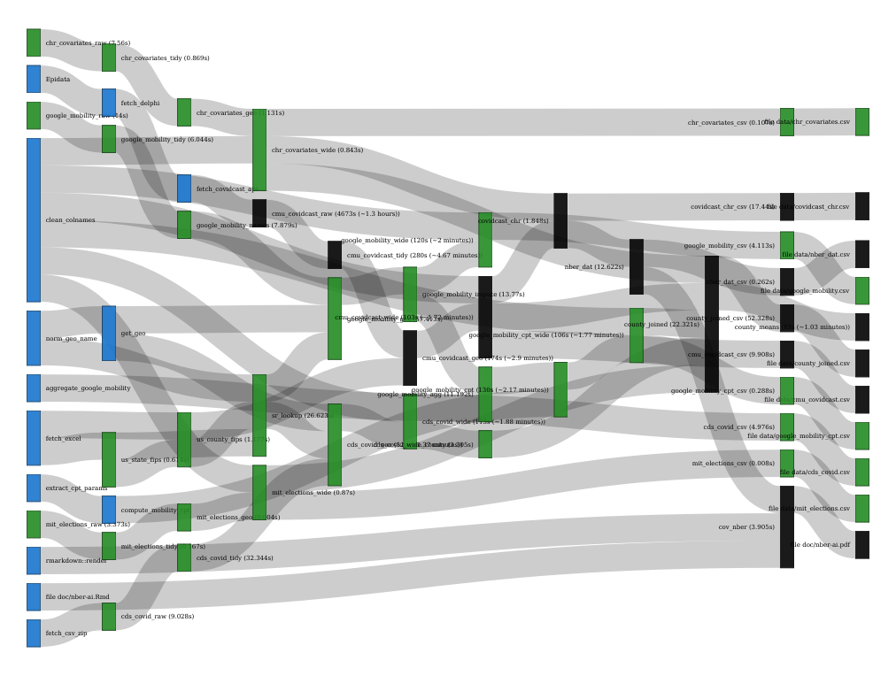

```{r global_options, include=FALSE}
knitr::opts_chunk$set(echo=FALSE, warning=FALSE, message=FALSE)
```

```{r include=FALSE}
# install.packages("fable", "plotly", "BoomSpikeSlab", "drake", "huxtable",
#                  "tidyverse", "ranger", "missRanger", "pdp", "caret")
spike_slab_iter <- 100
library(fable)
library(plotly)
library(BoomSpikeSlab)
library(drake)
library(huxtable)
library(ranger)
library(missRanger)
library(pdp)
library(caret)
library(tidyverse)
nber_dat <- read_csv("https://ond3.com/covdata/nber_dat.csv")
```

# Motivation

Confirmed cases and deaths are reported daily by [Johns Hopkins](https://coronavirus.jhu.edu/us-map) and are updated on a periodic basis.   However, these data are often reported with a lag and it would be helpful to have a contemporaneous prediction (a nowcast) based on easily observed predictors for at least two reasons:

1. this would help hospitals ready for an increase in patients, and
2. this would help contract tracing efforts focus on areas where there might be potential outbreaks.

We explore the potential of survey-based data as a way to accurately measure the incidence of disease for these purposes. This notebook focuses on a cross-sectional geographical analysis of incidence while a follow up will focus on the time dimension.

## Problem Statement

## Survey of self-reported symptoms

## Proxy questions

# Basic model

## Univariate

Our basis model is very simple.  We have two variables,  $pJ$, defined as confirmed cases as a fraction of population from John Hopkins, and $pG$, defined as the fraction of Google Survey respondents who answer “yes” to the proxy question.

Our hypothesis is that $pJ = k*pG + e$ where $k$ is a parameter to be estimated and $e$ is an error term.  We could estimate this equation directly, but we could also use the definitions of $pG$ and $pJ$ to write:
		            
$$
\begin{aligned}
\frac{cases}{population} \sim  \frac{yes}{yes+no}
\end{aligned}
$$
		            
Taking logs:
$$
\begin{aligned}
log(cases) = log(k) + \beta_1 log(population) + \beta_2 log (pG) + e \\ = log(k) + \beta_1 log(population) + \beta_2 log (yes) - \beta_3 log(yes+no) + e
\end{aligned}
$$

We can estimate either of these equations depending on data availability.  We can also add various controls such as country health characteristics, lagged values of cases, county fixed effects, and so on.  But even if we use this very simple specification, we get nice results, as shown in this plot of actual versus predicted cases.

```{r}
goog_mdl <- lm(log(jhu_csse_confirmed_incidence_num_value + 1) ~
     log(google_survey_raw_cli_value + 1) +
       log(google_survey_raw_cli_sample_size + 1) +
       log(population + 1), 
   data = nber_dat %>% column_to_rownames("county_name"))

huxreg(goog_mdl, statistics = c(N = "nobs", R2 = "r.squared"))

data.frame(fitted = goog_mdl$fitted.values, actual = goog_mdl$model[,1],
           population = goog_mdl$model[,4], fips = rownames(goog_mdl$model)) %>%
  ggplot(aes(actual, fitted, label = fips)) + geom_point() +
  geom_abline(slope = 1) + 
  theme_minimal() + theme(legend.position = "none") + coord_fixed() -> p
ggplotly(p)
```

### Train/test

```{r}
nber_train_test <- nber_dat %>% mutate(
  sample_type = if_else(rbinom(n(), 1, 0.75) == 1, "train", "test"))

goog_mdl_train <- lm(log(jhu_csse_confirmed_incidence_num_value + 1) ~
     log(google_survey_raw_cli_value + 1) +
       log(google_survey_raw_cli_sample_size + 1) +
       log(population + 1), 
   data = nber_train_test %>%
     column_to_rownames("county_name") %>%
     filter(sample_type == "train"))

goog_mdl_test <- data.frame(
  predicted = predict(
    goog_mdl_train,
    nber_train_test %>% filter(sample_type == "test")),
  actual = nber_train_test %>% filter(sample_type == "test") %>%
    select(jhu_csse_confirmed_incidence_num_value) %>%
    mutate_all(~ log(.x + 1)) %>%
    pull(jhu_csse_confirmed_incidence_num_value)) %>%
  filter(complete.cases(.))

goog_test_r2 <- goog_mdl_test %>%
  mutate(resid_sq = (actual - predicted)^2) %>%
  summarise(rss = sum(resid_sq), var_y = var(actual) * n()) %>%
  mutate(r2 = 1 - rss / var_y) %>% pull(r2) %>%
  round(2)

goog_mdl_test %>% ggplot(aes(predicted, actual)) + geom_point() +
  ggtitle(paste("test r^2 =", goog_test_r2)) -> p
ggplotly(p)
```

### Proxy questions

Earlier we saw how well the community-based question in Google surveys proxied for county-level incidence but how would this compare to a question that simply asked the question directly to an individual? An analogous set of surveys run by Facebook asked the question at the individual level which initially did not have much predictive value until it was changed to mimic the community-based Google question.

```{r}
fb_indiv_spec <- lm(
  log(jhu_csse_confirmed_incidence_num_value + 1) ~
    log(fb_survey_raw_cli_value + 1) +
    log(fb_survey_raw_cli_sample_size + 1) +
    log(population + 1),
  data = nber_dat %>% filter(!is.na(fb_survey_raw_hh_cmnty_cli_value)))

fb_comm_spec <- lm(
  log(jhu_csse_confirmed_incidence_num_value + 1) ~
    log(fb_survey_raw_hh_cmnty_cli_value + 1) +
    log(fb_survey_raw_hh_cmnty_cli_sample_size + 1) +
    log(population + 1),
   data = nber_dat %>% column_to_rownames("county_name"))

fb_comm_nohh_spec <- lm(log(jhu_csse_confirmed_incidence_num_value + 1) ~
     log(fb_survey_raw_nohh_cmnty_cli_value + 1) +
       log(fb_survey_raw_nohh_cmnty_cli_sample_size + 1) +
       log(population + 1),
   data = nber_dat %>% column_to_rownames("county_name"))

ht <- huxreg(fb_indiv_spec, fb_comm_spec, fb_comm_nohh_spec,
             statistics = c(N = "nobs", R2 = "r.squared"))
position(ht) <- "left"
ht
```

# County rankings

## Use other county predictors from health ranking

## Spike-slab + random forests from county health data

We find that the Google survey provides a reliable measure of county-level incidence across counties. The question itself is meant to ask about COVID-like illness (symptoms) rather than testing positive.  Therefore it's measuring something fundamentally different than the population who actually gets tested and receives a test and we would expect some variation around this measure.

```{r}
goog_mdl <- lm(log(jhu_csse_confirmed_incidence_num_value + 1) ~
     log(google_survey_raw_cli_value + 1) +
       log(google_survey_raw_cli_sample_size + 1) +
       log(population + 1), 
   data = nber_dat %>%
     column_to_rownames("county_name"))
huxreg(goog_mdl, statistics = c(N = "nobs", R2 = "r.squared"))

data.frame(fitted = goog_mdl$fitted.values, actual = goog_mdl$model[,1],
           population = goog_mdl$model[,4], fips = rownames(goog_mdl$model)) %>%
  ggplot(aes(actual, fitted, label = fips)) +
  geom_point(aes(color = goog_mdl$residuals)) +
  scale_color_gradient2() +
  theme_minimal() + theme(legend.position = "none") + coord_fixed() -> p
ggplotly(p)
```

Above we repeated the earlier basic regression. Here we now examine the remaining residuals in an attempt to explain some of the discrepancies between having symptoms and producing actual confirmed cases. Having positive and negative residuals could be explained by a number of factors and we explore below what these factors may be. We consider whether these factors explain the difference from COVID under or over reporting, conditional on COVID-like symptoms - or real variation in the actual illness across counties.

```{r results="hide"}
county_covars <- read_csv("https://ond3.com/covdata/county_covars.csv")
# # cor_cols <- cor_cols <- nber_dat %>%
# #   select(pct_65_and_older:year_structure_built) %>%
# #   cor(use = "pairwise.complete") %>%
# #   findCorrelation(names = TRUE)
# county_covars_all <- nber_dat %>%
#   select(pct_65_and_older:year_structure_built, county_name) %>%
#   missRanger(. ~ . - county_name)
# 
# cor_cols <- county_covars_all %>%
#   select(-county_name) %>%
#   cor(use = "pairwise.complete") %>%
#   findCorrelation(names = TRUE)
# 
# county_covars <- county_covars_all %>%
#   select(-one_of(cor_cols), -long_commute_driving_alone,
#          -residential_segregation_black_white,
#          -self_inflicted_injury_hospitalizations,
#          -food_environment_index) #%>%
#   #select_if(~ mean(is.na(.x)) < 0.05) %>%
```

```{r d0, results="hide"}
tibble(county_name = names(residuals(goog_mdl)), res = residuals(goog_mdl)) %>%
  left_join(county_covars, by = "county_name") %>%
  column_to_rownames("county_name") %>%
  lm.spike(res ~ ., data = ., niter = spike_slab_iter) -> ss_mdl
```

```{r}
rsq <- summary(ss_mdl)$rsquare %>% .[["Mean"]] %>% setNames("rsquare")
ss_mdl %>% plot("inclusion", inclusion.threshold = 0.5,
                main = paste("r-square:", round(rsq, 2)))
```

The additional covariates explain `r round(rsq*100)`% of the remaining variance in the residuals.

We see that increased food insecurity (likely measure of poverty) appears to result in lower confirmed cases relative to covid-like illness. One could imagine a number of explanations for this, including fewer testing facilities in poorer counties - or less infection due to an association between poverty and lower mobility/density.  We also see that racial segregation and black communities play a role as well. Both segregation and an increasing black population predict higher confirmed cases.

We repeat the same analysis with random forests to see if covariate interactions explain more:

```{r}
tibble(county_name = names(residuals(goog_mdl)), res = residuals(goog_mdl)) %>%
  left_join(county_covars, by = "county_name") %>%
  column_to_rownames("county_name") %>%
  select(-pct_native_hawaiian_other_pacific_islander) %>%
  ranger(res ~ ., data = ., importance = "impurity") -> ranger_mdl

ranger_mdl %>% importance() %>%
  tibble(var = names(.), importance = .) %>%
  top_n(10, importance) %>%
  mutate(var = fct_reorder(var, importance)) %>%
  ggplot(aes(var, importance)) + geom_bar(stat = "identity") +
  coord_flip() + xlab(element_blank()) +
  ggtitle(paste("r-square:", round(ranger_mdl$r.squared, 2))) +
  theme_minimal()
```

Variance explained is about the same as do many of the predictors. Food insecurity and racial segregation both remain as meaningful predictors but other characteristics also appear. Other interesting factors emerge such as suicides and English proficiency, 

With tree-based methods there isn't a uniformly positive or negative linear relationship with a predictor but the relationships can be explored via "Partial Dependance Plots" which hold other values at median values and vary across the support of the predictor against the outcome. This provides some insight as to (a) the shape of the response and (b) the support within which the response is affected.

```{r eval=FALSE, fig.height=10, include=FALSE}
top_vars <- importance(ranger_mdl) %>% sort %>% tail(10) %>% rev() %>% names()
pdps <- lapply(top_vars, FUN = function(x) {
  ranger_mdl %>%
    pdp::partial(pred.var = x, train = county_covars) %>%
    pdp::plotPartial()
})
do.call("grid.arrange", c(pdps, ncol=2))
```

Some intuitive findings are increases in social associations predicting more confirmed cases, and older adults living alone (less nursing homes) as an indicator of the opposite.

##### Deaths

Previously we examined the covariates that predict variation between reported symptoms to confirmed cases, now we examine the same from reported symptoms to confirmed deaths. One could argue that deaths are less sensitive to testing procedures than cases and there may be many more county characteristic factors that explain why illness may not or may not translate to a recorded death. Since we don't expect deaths to map linearly to increased illness we model deaths as the square root of illness:

TODO(robon): Try box-cox transform of illness.

$$ \frac{deaths}{population} = k*\frac{\sqrt{yes}}{yes+no}$$

so we estimate:

$$ \log(deaths) = log(k) + \beta_1log(population) + \beta_2log(\sqrt{yes}) + \beta_3log(yes+no) + e$$

```{r d1, message=FALSE, warning=FALSE}
deaths_mdl <- lm(log(sqrt(jhu_csse_deaths_incidence_num_value) + 1) ~
     log(google_survey_raw_cli_value + 1) +
       log(google_survey_raw_cli_sample_size + 1) +
       log(population + 1), 
   data = nber_dat %>%
     column_to_rownames("county_name"))
huxreg(deaths_mdl, statistics = c(N = "nobs", R2 = "r.squared"))

data.frame(fitted = deaths_mdl$fitted.values, actual = deaths_mdl$model[,1],
           population = deaths_mdl$model[,4], fips = rownames(deaths_mdl$model)) %>%
  ggplot(aes(actual, fitted, label = fips)) +
  #geom_point(aes(color = deaths_mdl$residuals)) +
  geom_point() +
  theme_minimal() + theme(legend.position = "none") + coord_fixed() -> p
ggplotly(p)
```

We get a linear relationship between our predictions and actual values.

```{r d2, results="hide"}
tibble(county_name = names(residuals(deaths_mdl)), res = residuals(deaths_mdl)) %>%
  left_join(county_covars, by = "county_name") %>%
  column_to_rownames("county_name") %>%
  lm.spike(res ~ ., data = ., niter = spike_slab_iter) -> ss_mdl
```

```{r d3}
rsq <- summary(ss_mdl)$rsquare %>% .[["Mean"]] %>% setNames("rsquare")
ss_mdl %>% plot("inclusion", inclusion.threshold = 0.5,
                main = paste("r-square:", round(rsq, 2)))
```

Racial segregation is a consistent factor both in modeling cases and deaths. There could be a number of explanations for this. Another indicator that stands out is the number of people driving to work alone. While this is often seen as a negative characteristic it serves as an intuitive factor for why shared modes of transit such as subways may lead to greater amounts of infection and deaths. Having a younger population is also intuitive as it has been documented that the young are much less susceptible to Covid deaths.  Homeownership has a high probability of inclusion but we're uncertain as to how to explain its relationship.

```{r}
tibble(county_name = names(residuals(deaths_mdl)), res = residuals(deaths_mdl)) %>%
  left_join(county_covars, by = "county_name") %>%
  column_to_rownames("county_name") %>%
  select(-pct_native_hawaiian_other_pacific_islander) %>%
  ranger(res ~ ., data = ., importance = "impurity") -> ranger_mdl

ranger_mdl %>% importance() %>%
  tibble(var = names(.), importance = .) %>%
  top_n(10, importance) %>%
  mutate(var = fct_reorder(var, importance)) %>%
  ggplot(aes(var, importance)) + geom_bar(stat = "identity") +
  coord_flip() + xlab(element_blank()) +
  ggtitle(paste("r-square:", round(ranger_mdl$r.squared, 2))) +
  theme_minimal()
```

The random forests analysis of the same data has age related factors rising to the top. Homeownership remains important, along with racial segregation.

```{r eval=FALSE, fig.height=10, include=FALSE}
top_vars <- importance(ranger_mdl) %>% sort %>% tail(10) %>% rev() %>% names()
pdps <- lapply(top_vars, FUN = function(x) {
  ranger_mdl %>%
    pdp::partial(pred.var = x, train = county_covars) %>%
    pdp::plotPartial()
})
do.call("grid.arrange", c(pdps, ncol=2))
```

## Residuals, big regression or time fixed effect

Here we do the regression with all covariates as well as Google prop included.

```{r}
big_mdl <- nber_dat %>%
  select(county_name, jhu_csse_confirmed_cumulative_num_value,
         google_survey_raw_cli_value,
         google_survey_raw_cli_sample_size) %>%
  left_join(county_covars, by = "county_name") %>%
  mutate(google_survey_raw_cli_prop = google_survey_raw_cli_value /
           google_survey_raw_cli_sample_size) %>%
  select(-google_survey_raw_cli_value, -google_survey_raw_cli_sample_size) %>%
  filter(!is.na(google_survey_raw_cli_prop)) %>%
  column_to_rownames("county_name") %>%
  lm(jhu_csse_confirmed_cumulative_num_value ~ ., data = .)

huxreg(big_mdl, statistics = c(N = "nobs", R2 = "r.squared"))
```

# Forecasting

## K-step ahead

## ETS, AR

```{r}
covidcast <- read_csv("https://ond3.com/covdata/cmu_covidcast.csv",
                      col_types = cols(
                        geo_type = "c", geo_value = "c", date = "D",
                        county_name = "c", state_name = "c", state_abb = "c",
                        geocode = "c", .default = col_number()))
```

```{r}
covid_ts <- covidcast %>%
  filter(geo_type == "county") %>%
  mutate(county_name = paste(county_name, state_abb, sep = ", ")) %>%
  select(-geo_type, -geo_value, -state_name, -state_abb, -geocode) %>%
  as_tsibble(key = county_name, index = date)
```

```{r}
fcst <- covid_ts %>% filter(date < "2020-05-15") %>%
  fill(jhu_csse_confirmed_cumulative_num_value, .direction = "down") %>%
  select(jhu_csse_confirmed_cumulative_num_value) %>%
  filter(county_name %in% c("New York County, NY",
                            "Essex County, NJ",
                            "Wayne County, MI")) %>%
  model(
    ets = ETS(jhu_csse_confirmed_cumulative_num_value),
    arima = ARIMA(jhu_csse_confirmed_cumulative_num_value),
    rw = RW(jhu_csse_confirmed_cumulative_num_value)
  ) %>%
  forecast(h = "2 week")

fcst %>% accuracy(covid_ts)

fcst %>%
  fabletools::autoplot(covid_ts %>% filter(date > "2020-03-15"), level = 95)
```

## Curve fitting

# Appendix

## Using 595 counties is fine.

From the specifications above you may have noticed only 595 counties had non-missing data for the survey predictors. With over 3,000 counties this may raise some concern about response bias from the survey.  The figure below shows each of the surveyed questionnaires and what percent of counties are covered by them.

```{r}
nber_dat %>%
  select(population, contains("survey") & ends_with("_value")) %>%
  gather(metric, value, -population) %>%
  group_by(metric) %>%
  summarise(`covered counties` = mean(!is.na(value))) %>%
  mutate_at(vars(metric), ~ str_remove(.x, "_value")) %>%
  ggplot(aes(metric, `covered counties`)) + geom_col() + coord_flip() +
  ylim(0, 1) +
  xlab(element_blank())
```

The Facebook and Google surveys cover less than 20% of counties. However if we look at the covered population of these counties we find that, by population, these counties cover more than 75% of the population in the US.

```{r}
nber_dat %>%
  select(population, contains("survey") & ends_with("_value")) %>%
  gather(metric, value, -population) %>%
  filter(!is.nan(population)) %>%
  group_by(metric) %>%
  summarise(
    `covered population` = sum(population[!is.nan(value)]) / sum(population)) %>%
  mutate_at(vars(metric), ~ str_remove(.x, "_value")) %>%
  ggplot(aes(metric, `covered population`)) + geom_col() + coord_flip() +
  ylim(0, 1) + 
  xlab(element_blank())
```

## Fetching and wrangling the data

All data for this notebook are scraped directly from sources on the web so it can be easily updated with the most recent data. A system of data pipelines and caching enables efficient and consistent fetching, cleaning, manipulation, provenance and of analysis of the data.  The figure below describes the system of data processes that produce the figures and tables in this document. This system is enabled by a package named [drake](https://github.com/ropensci/drake).


A [drake plan](https://github.com/roboton/covid-covariates/blob/master/R/plan.R) instruments the production of these data sets and serve as a tool for data provenance, transparency and reproducibility. The analytical data sets are made available [here](https://ond3.com/covdata).

## Symptoms
