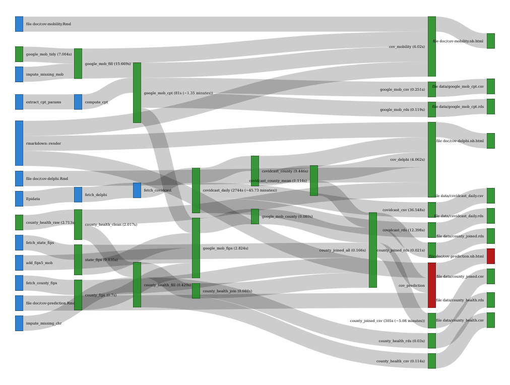

# Data

## Data description

The data set we're working with is `county_joined_all` which is generated from a `drake` plan. `drake` plans help improve replicability as well as provide improved performance and caching by taking advantage of a DAG-based data dependancy graph. More [here](https://github.com/roboton/covid-covariates/R/plan.R).


This data set includes outcomes from [JHU CSSE](https://github.com/CSSEGISandData/COVID-19) and predictors from [Google Mobility Reports](https://www.google.com/covid19/mobility/), [County Health Rankings](https://www.countyhealthrankings.org/), and [CMU Delphi COVIDcast](https://cmu-delphi.github.io/delphi-epidata/api/covidcast.html).

### Google Mobility Reports

The list of columns below are parameters from a change point analysis of each county mobility time series. Each mobility time series describes the percent change in mobility from the pre-period (2020-02-15) for six categories of locations: retail/recreation, grocery/pharmacy, parks, transit stations, workplaces and residential.

The change point analysis uses these time series to compute the potential drop in mobility:

- `change_start_date`: when the drop began
- `change_end_date`: when the change bottomed out
- `mean_before`: average mobility prior to `change_start_date`
- `mean_after`: average mobility after `change_end_date`
- `var_before`: variance in mobility prior to `change_start_date`
- `var_after`: variance in mobility after `change_end_date`
- `change_diff`: the difference between `mean_before` and `mean_after`
- `change_days`: number of days between `change_start_date` and `change_end_date`
- `change_slope`: pace of change, `change_diff` divided by `change_days`
- `revert`: difference in mobility between the current period and the lowest period 

More information about these mobility parameters can be found [here](https://ond3.com/cov-mobility.nb.html).

```{r}
readd(county_joined_all) %>%
  select(starts_with("mob_")) %>%
  summarise_all(~ mean(is.na(.x))) %>%
  gather(predictor, pct_counties_missing) %>%
  arrange(desc(pct_counties_missing))
```

We can see here that there are a fair number of missing values in these measures. This is work-in-progress to be improved.

### County Health Rankings

The second set of covariates come from County Health Rankings are are described [here](https://www.countyhealthrankings.org/explore-health-rankings/measures-data-sources/2020-measures). They serve as a set of static descriptors of each county.

```{r}
readd(county_joined_all) %>%
  select(starts_with("chr_")) %>%
  summarise_all(~ mean(is.na(.x))) %>%
  gather(predictor, pct_counties_missing) %>%
  arrange(desc(pct_counties_missing))
```

### CMU Delphi Epidata

The third are a set of potential leading indicators of COVID severity from surveys, doctor visits, and other sources better described [here](https://cmu-delphi.github.io/delphi-epidata/api/covidcast.html).

```{r}
readd(county_joined_all) %>%
  select(starts_with("cmu_")) %>%
  summarise_all(~ mean(is.na(.x))) %>%
  gather(predictor, pct_counties_missing) %>%
  arrange(desc(pct_counties_missing))
```

## Reproducibility

```{r}
## datetime
Sys.time() 

## repository
git2r::repository()

## session info
sessionInfo()
```
