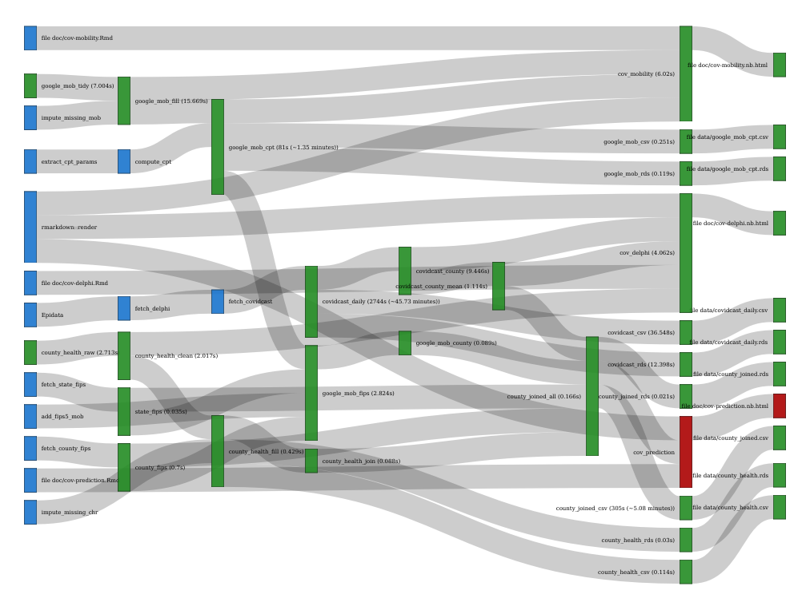

The purpose of this notebook is to estimate the value of county level covariates towards predicting COVID-related outcomes.

## Data description

The data set we're working with is `county_joined_all` which is generated from a `drake` plan. `drake` plans help improve replicability as well as provide improved performance and caching by taking advantage of a DAG-based data dependancy graph. More [here](https://github.com/roboton/covid-covariates).


This data set includes outcomes from [JHU CSSE](https://github.com/CSSEGISandData/COVID-19) and predictors from [Google Mobility Reports](https://www.google.com/covid19/mobility/), [County Health Rankings](https://www.countyhealthrankings.org/), and [CMU Delphi COVIDcast](https://cmu-delphi.github.io/delphi-epidata/api/covidcast.html).

### Google Mobility Reports

The list of columns below are parameters from a change point analysis of each county mobility time series. Each mobility time series describes the percent change in mobility from the pre-period (2020-02-15) for six categories of locations: retail/recreation, grocery/pharmacy, parks, transit stations, workplaces and residential.

The change point analysis uses these time series to compute the potential drop in mobility:

- `change_start_date`: when the drop began
- `change_end_date`: when the change bottomed out
- `mean_before`: average mobility prior to `change_start_date`
- `mean_after`: average mobility after `change_end_date`
- `var_before`: variance in mobility prior to `change_start_date`
- `var_after`: variance in mobility after `change_end_date`
- `change_diff`: the difference between `mean_before` and `mean_after`
- `change_days`: number of days between `change_start_date` and `change_end_date`
- `change_slope`: pace of change, `change_diff` divided by `change_days`
- `revert`: difference in mobility between the current period and the lowest period 

More information about these mobility parameters can be found [here](https://ond3.com/cov-mobility.nb.html).

```{r}
readd(county_joined_all) %>%
  select(5:64) %>%
  summarise_all(~ mean(is.na(.x))) %>%
  gather(predictor, pct_counties_missing) %>%
  arrange(desc(pct_counties_missing))
```

We can see here that there are a fair number of missing values in these measures. This is work-in-progress to be improved.

### County Health Rankings

The second set of covariates come from County Health Rankings are are described [here](https://www.countyhealthrankings.org/explore-health-rankings/measures-data-sources/2020-measures). They serve as a set of static descriptors of each county.

```{r}
readd(county_joined_all) %>%
  select(65:125) %>%
  summarise_all(~ mean(is.na(.x))) %>%
  gather(predictor, pct_counties_missing) %>%
  arrange(desc(pct_counties_missing))
```

### CMU Delphi Epidata

The third are a set of potential leading indicators of COVID severity from surveys, doctor visits, and other sources better described [here](https://cmu-delphi.github.io/delphi-epidata/api/covidcast.html).

```{r}
readd(county_joined_all) %>%
  select(126:146) %>%
  summarise_all(~ mean(is.na(.x))) %>%
  gather(predictor, pct_counties_missing) %>%
  arrange(desc(pct_counties_missing))
```

### Missing values

As suggested in the tables above, each of these columns are missing some predictors since there isn't full coverage for all counties. There is a trade off in having more predictors vs more counties. The graph below helps us manage this trade off.

```{r}
missing_seq <- seq(0.01, 0.99, by = 0.01)
lapply(missing_seq, FUN = function(thresh) {
  d <- readd(county_joined_all) %>%
    select_if(~ mean(is.na(.x)) < thresh) %>%
    select(-starts_with("jhu-")) %>%
    drop_na() %>%  dim()
  list(counties = d[1], predictors = d[2], thresh = thresh)
}) %>% bind_rows() %>%
  ggplot(aes(predictors, counties, label=thresh)) + geom_line() -> p
ggplotly(p)
```

From a quick eye-ball it appears optimal to use 2170 counties with 101 predictors which suggests a threshold limiting us to use predictors with less than 31% missing values (`county_joined_rich`). We can also experiment with a model with 3118 counties and 46 predictors with a 3% threshold (`county_joined_sparse`). A third model is one that has a full set of predictors (139) but only covers 295 counties (`county_joined_full`) that allows for 92% missing values.`

### Outcomes

The folks at the Delphi project have convenient provided COVID case and death counts from JHU in their data set.

```{r}
prep_data <- function(thresh) {
  readd(county_joined_all) %>%
    select_if(~ mean(is.na(.x)) <= thresh) %>% drop_na() %>%
    unite(name, name_county, name_state, sep = ", ") %>%
    select(-state_fips, -fips5) %>%
    column_to_rownames("name") %>%
    rename_at(vars(ends_with(" raw value")), ~ str_remove(.x, " raw value")) %>%
    rename_at(vars(ends_with("_percent_change_from_baseline")),
              ~ str_remove(.x, "_percent_change_from_baseline"))
}

county_joined_full <- prep_data(0.92)
county_joined_rich <- prep_data(0.31)
county_joined_sparse <- prep_data(0.03)
```


```{r}
bind_rows(
  county_joined_full %>% select(starts_with("jhu"), Population) %>%
    mutate(predictors = ncol(county_joined_full), counties = n()) %>%
    summarise_all(mean, na.rm = TRUE) %>% mutate(dataset = "full"),
  county_joined_rich %>% select(starts_with("jhu"), Population) %>%
    mutate(predictors = ncol(county_joined_rich), counties = n()) %>%
    summarise_all(mean, na.rm = TRUE) %>% mutate(dataset = "rich"),
  county_joined_sparse %>% select(starts_with("jhu"), Population) %>%
    mutate(predictors = ncol(county_joined_sparse), counties = n()) %>%
    summarise_all(mean, na.rm = TRUE) %>% mutate(dataset = "sparse")
) %>% select(dataset, predictors, counties, Population, everything()) %>%
  rename_at(vars(starts_with("jhu")), ~ str_remove(.x, "jhu-csse_"))
```

We notice in general that COVID cases and deaths are lower in the `sparse` data compared to the `full` data. It's likely that the sparse set contains smaller counties that had more missing predictors. The incidence and death proportions are closer in value between the two sets and looks to be a more resilient outcome to use.

## Prediction

With our three data sets (sparse, rich and full) and two outcomes (proportion of confirmed incidence and deaths), we can go ahead and make predictions using our set of predictors. We start with a regularized regression with the [Spike-and-Slab](https://www.rdocumentation.org/packages/BoomSpikeSlab/versions/1.2.3/topics/lm.spike) package which provides a Bayesian approach towards variable selection similar to the LASSO. We also try square root and logit transformations of the response variables.

### All variables

Varied rows based on NAs.

```{r message=FALSE, warning=FALSE, results="hide"}
iters <- 10000

deaths_full <- county_joined_full %>%
  select(-starts_with("jhu-"), `jhu-csse_deaths_incidence_prop`) %>%
  lm.spike(`jhu-csse_deaths_incidence_prop` ~ ., data = ., niter=iters)
deaths_rich <- county_joined_rich %>%
  select(-starts_with("jhu-"), `jhu-csse_deaths_incidence_prop`) %>%
  lm.spike(`jhu-csse_deaths_incidence_prop` ~ ., data = ., niter=iters)
deaths_sparse <- county_joined_sparse %>%
  select(-starts_with("jhu-"), `jhu-csse_deaths_incidence_prop`) %>%
  lm.spike(`jhu-csse_deaths_incidence_prop` ~ ., data = ., niter=iters)

cases_full <- county_joined_full %>%
  select(-starts_with("jhu-"), `jhu-csse_confirmed_incidence_prop`) %>%
  lm.spike(`jhu-csse_confirmed_incidence_prop` ~ ., data = ., niter=iters)
cases_rich <- county_joined_rich %>%
  select(-starts_with("jhu-"), `jhu-csse_confirmed_incidence_prop`) %>%
  lm.spike(`jhu-csse_confirmed_incidence_prop` ~ ., data = ., niter=iters)
cases_sparse <- county_joined_sparse %>%
  select(-starts_with("jhu-"), `jhu-csse_confirmed_incidence_prop`) %>%
  lm.spike(`jhu-csse_confirmed_incidence_prop` ~ ., data = ., niter=iters)

deaths_full_sqrt <- county_joined_full %>%
  select(-starts_with("jhu-"), `jhu-csse_deaths_incidence_prop`) %>%
  lm.spike(sqrt(`jhu-csse_deaths_incidence_prop`) ~ ., data = ., niter=iters)
deaths_rich_sqrt <- county_joined_rich %>%
  select(-starts_with("jhu-"), `jhu-csse_deaths_incidence_prop`) %>%
  lm.spike(sqrt(`jhu-csse_deaths_incidence_prop`) ~ ., data = ., niter=iters)
deaths_sparse_sqrt <- county_joined_sparse %>%
  select(-starts_with("jhu-"), `jhu-csse_deaths_incidence_prop`) %>%
  lm.spike(sqrt(`jhu-csse_deaths_incidence_prop`) ~ ., data = ., niter=iters)

cases_full_sqrt <- county_joined_full %>%
  select(-starts_with("jhu-"), `jhu-csse_confirmed_incidence_prop`) %>%
  lm.spike(sqrt(`jhu-csse_confirmed_incidence_prop`) ~ ., data = ., niter=iters)
cases_rich_sqrt <- county_joined_rich %>%
  select(-starts_with("jhu-"), `jhu-csse_confirmed_incidence_prop`) %>%
  lm.spike(sqrt(`jhu-csse_confirmed_incidence_prop`) ~ ., data = ., niter=iters)
cases_sparse_sqrt <- county_joined_sparse %>%
  select(-starts_with("jhu-"), `jhu-csse_confirmed_incidence_prop`) %>%
  lm.spike(sqrt(`jhu-csse_confirmed_incidence_prop`) ~ ., data = ., niter=iters)

deaths_full_logit <- county_joined_full %>%
  select(-starts_with("jhu-"), `jhu-csse_deaths_incidence_prop`) %>%
  logit.spike(`jhu-csse_deaths_incidence_prop` ~ ., data = ., niter=iters)
deaths_rich_logit <- county_joined_rich %>%
  select(-starts_with("jhu-"), `jhu-csse_deaths_incidence_prop`) %>%
  logit.spike(`jhu-csse_deaths_incidence_prop` ~ ., data = ., niter=iters)
deaths_sparse_logit <- county_joined_sparse %>%
  select(-starts_with("jhu-"), `jhu-csse_deaths_incidence_prop`) %>%
  logit.spike(`jhu-csse_deaths_incidence_prop` ~ ., data = ., niter=iters)

cases_full_logit <- county_joined_full %>%
  select(-starts_with("jhu-"), `jhu-csse_confirmed_incidence_prop`) %>%
  logit.spike(`jhu-csse_confirmed_incidence_prop` ~ ., data = ., niter=iters)
cases_rich_logit <- county_joined_rich %>%
  select(-starts_with("jhu-"), `jhu-csse_confirmed_incidence_prop`) %>%
  logit.spike(`jhu-csse_confirmed_incidence_prop` ~ ., data = ., niter=iters)
cases_sparse_logit <- county_joined_sparse %>%
  select(-starts_with("jhu-"), `jhu-csse_confirmed_incidence_prop`) %>%
  logit.spike(`jhu-csse_confirmed_incidence_prop` ~ ., data = ., niter=iters)

```

```{r}
mdls <- list(cases_full, deaths_full, cases_rich, deaths_rich,
             cases_sparse, deaths_sparse,
             cases_full_sqrt, deaths_full_sqrt, cases_rich_sqrt, deaths_rich_sqrt,
             cases_sparse_sqrt, deaths_sparse_sqrt,
             cases_full_logit, deaths_full_logit, cases_rich_logit, deaths_rich_logit,
             cases_sparse_logit, deaths_sparse_logit)
mdl_names <- c("cases_full", "deaths_full", "cases_rich", "deaths_rich",
               "cases_sparse", "deaths_sparse",
               "cases_full_sqrt", "deaths_full_sqrt", "cases_rich_sqrt", 
               "deaths_rich_sqrt",
               "cases_sparse_sqrt", "deaths_sparse_sqrt",
               "cases_full_logit", "deaths_full_logit", "cases_rich_logit", "
               deaths_rich_logit",
               "cases_sparse_logit", "deaths_sparse_logit")
rsq_df <-bind_rows(
  tibble(
    model = mdl_names[1:12],
    predictors = mdls[1:12] %>% map_int(~ ncol(.x$training.data)),
    counties = mdls[1:12] %>% map_int(~ nrow(.x$training.data)),
    rsq = mdls[1:12] %>% map_dbl(~ summary(.x)$rsquare[["Mean"]])),
  tibble(
    model = mdl_names[13:18],
    predictors = mdls[13:18] %>% map_int(~ ncol(.x$training.data)),
    counties = mdls[13:18] %>% map_int(~ nrow(.x$training.data)),
    rsq = mdls[13:18] %>% map_dbl(~ summary(.x)[["deviance.r2"]])))

rsq_df
```

```{r}
tmp <- sapply(1:length(mdls), FUN = function(x) {
  mdl <- mdls[[x]]
  rsq <- rsq_df$rsq[x]
  plot(mdl, "inclusion", inclusion.thresh = 0.25,
       main = paste(mdl_names[x], paste0(nrow(mdl$training.data), " counties"),
                    paste0("rsq: ", round(rsq, 2)), sep = " - ")) })
```

### Dataset predictive value

What is the predictive value for the mobility, community health rankings, and COVIDcast data? Only the full model has variables from all data sets.

```{r message=FALSE, warning=FALSE, results="hide"}
cases_full_mob <- county_joined_full %>%
  select(1:60, -starts_with("jhu-"), `jhu-csse_confirmed_incidence_prop`) %>%
  lm.spike(`jhu-csse_confirmed_incidence_prop` ~ ., data = ., niter=iters)

cases_full_chr <- county_joined_full %>%
  select(61:121, -starts_with("jhu-"), `jhu-csse_confirmed_incidence_prop`) %>%
  lm.spike(`jhu-csse_confirmed_incidence_prop` ~ ., data = ., niter=iters)

cases_full_cmu <- county_joined_full %>%
  select(122:129, -starts_with("jhu-"), `jhu-csse_confirmed_incidence_prop`) %>%
  lm.spike(`jhu-csse_confirmed_incidence_prop` ~ ., data = ., niter=iters)
```

```{r}
mdls <- list(cases_full_mob, cases_full_chr,
             cases_full_cmu)
mdl_names <- c("cases_full_mob", "cases_full_chr",
               "cases_full_cmu")
rsq_df <- tibble(
  model = mdl_names,
  predictors = mdls %>% map_int(~ ncol(.x$training.data)),
  counties = mdls %>% map_int(~ nrow(.x$training.data)),
  rsq = mdls %>% map_dbl(~ summary(.x)$rsquare[["Mean"]]))
rsq_df
```

```{r}
tmp <- sapply(1:length(mdls), FUN = function(x) {
  mdl <- mdls[[x]]
  rsq <- rsq_df$rsq[x]
  plot(mdl, "inclusion", inclusion.thresh = 0.25,
       main = paste(mdl_names[x], paste0(nrow(mdl$training.data), " counties"),
                    paste0("rsq: ", round(rsq, 2)), sep = " - ")) })
```

## Reproducibility

```{r}
## datetime
Sys.time() 

## repository
git2r::repository()

## session info
sessionInfo()
```
